# **BookNook**

## Overview

**BookNook** BookNook is a community platform designed to connect readers and literary enthusiasts, providing a space for members to easily discover new books. The platform caters to book lovers who wish to delve into book details, save their favorite titles for future reading, and engage with the community by writing reviews. Aimed primarily at adult readers, the site fosters connections among like-minded individuals through shared book reviews. Additionally, it offers robust tools for administrators to effectively manage content, moderate reviews, and maintain the book database.

This project is part of the Code Institute's Full-Stack Developer course and focuses on the Django framework, database manipulation, and CRUD functionality.

<!-- 
[Live project](https://book-club-acf9649c2594.herokuapp.com/)

[Django administration](https://book-club-acf9649c2594.herokuapp.com/admin/) -->

Admin Username: bookend

Password: debbiesproject

[Project Board](https://github.com/users/DebbieCoates/projects/13)

## UX - User Experience

### Design Inspiration

My inspiration for designing this book review project stems from my deep love of books. I aimed to create a clean and 
uncluttered interface, with clear, crisp forms and reader-friendly fonts, to ensure an enjoyable and seamless experience for all book lovers.

### Colour Scheme & Font

Because I appreciate a clean and minimalistic design, I opted for white backgrounds for my HTML pages and used standard HTML fonts. The only exception to this was a background from Creative Fabrica, featuring a splash of greens to complement my hero image.


## Project Planning

Brainstorming with GitHub Copilot was instrumental in developing the foundations for this project. By leveraging Copilot's AI-driven suggestions, I was able to quickly generate ideas for key features, user stories, and database design. This collaborative approach ensured that I covered all essential aspects of the project, from user authentication to library management, while also considering future enhancements. Copilot's ability to provide context-aware recommendations significantly streamlined the planning process, allowing me to focus on creating a comprehensive and engaging platform for Book Nook users.


### Strategy Plan

The primary objective of Book Nook is to bridge the gap between book enthusiasts and a vast library of literature. By offering an intuitive interface, users can easily search for books, leave reviews, and add books to their wish list, creating a seamless and enjoyable reading experience.

### Site Goals

- Community Engagement: Foster a sense of community among book lovers, this helps members connect, share their thoughts, and build relationships around their mutual love of books.

- User-Friendly Interface: Ensure the website is easy to navigate with a clean and intuitive design. This includes clear menus, and responsive design for various devices. A user-friendly interface makes it easier for members to find and engage with content.

- Allows Admins to manage the website.

### Agile Methodologies - Project Management

I used an agile approach to project management. 

### MoSCoW Prioritization

- **Must-Haves:** User registration and login, role-based dashboards.
- **Should-Haves:** Add/Edit a Book, Add/Edit  a review,  Add to wishlist
- **Could-Haves:** Profile pictures for users 
- **would like to have:** Book recomendatons, Top 10 books, Profile picture

## User Stories

- As a member, I want to log in securely so that I can access my dashboard and manage my activities.
- As a member I want to leave a review and rating for books I have read.
- As Admin I want to be able to add, edit and delete books and posts from the database so that I can manage the content on the platform.
- As a visitor, I want to sign up easily, so that I can join the Book Nook.
- As a member I can delete any reviews I have written.
- As a member I can remove books I've read or am no longer interested in.
- As a member I want o add books to my Wish List, so that i can save the book for future reading.
- As a member, I want to view all the books listed
- As a member, I would like to view the top ten rated books based on other members recommendations, in order to suggest my next read.
- As an admin, I want to see the profile images of members, so that I can verify their identity and ensure a professional presence on the platform.
- As a member I would like to be able t refer books to other users if I like them.
- As an admin, I want to be able to approve any books added to the website in order to validate their appropriateness for the website.
- As a member, I would like the ability to add books to the website so that they can be displayed and reviewed by others.

## Scope Plane

The BookNook platform will include the following MVP functionalities:
- User registration and role-based navigation.
- view a list of all books.
- view of list of books on users wishlist.
- view individual books.
- Add/update a member profile.
- Add/update a book review.
- (Admin only) view a list of books waiting to be approved for uploading onto the website.
- (Admin only) view a list of All books listed on the website and delete any if required.


## Structural Plane

The site is structured around an easy-to-use interface. The primary menu includes links to all features applicble to role (Member, Admin).

non-member:    Home | USER LOGGON MESSAGE | Register | Login
Members:       Home | Books | USER LOGGON MESSAGE | Add Book | Wishlist | Profile | Logout
Admin :        Home | Books | USER LOGGON MESSAGE | Add Book | Pendig Apptovals | Book List | Wishlist | Profile | Logout


## Future Features

I plan to implement the following in future iterations:
- The ability to reccomend a book to other users.
- The ability to add a user profile picture
- Have a top 10 book page with the top 10 books listed by user reviews/ratings

## Skeleton & Surface Planes

### Wireframes

Wireframes were created for the following key pages to ensure an intuitive user journey:

- **Home Page**
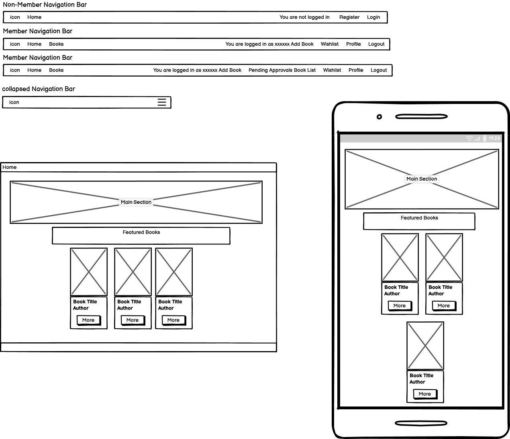

- **Books**
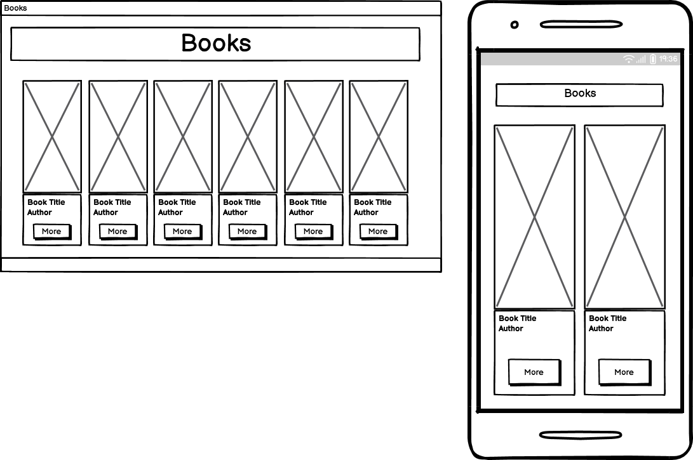

- **Book List**
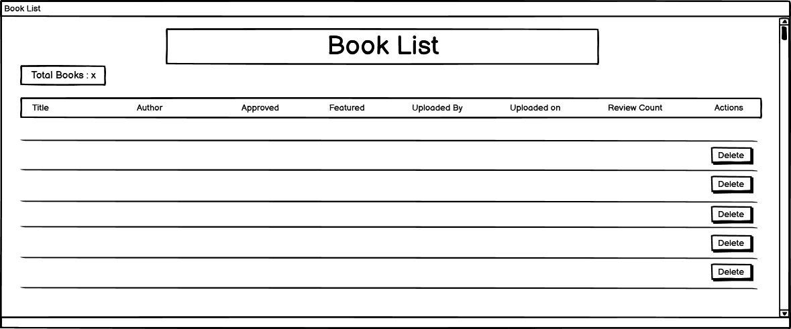

- **Book List**
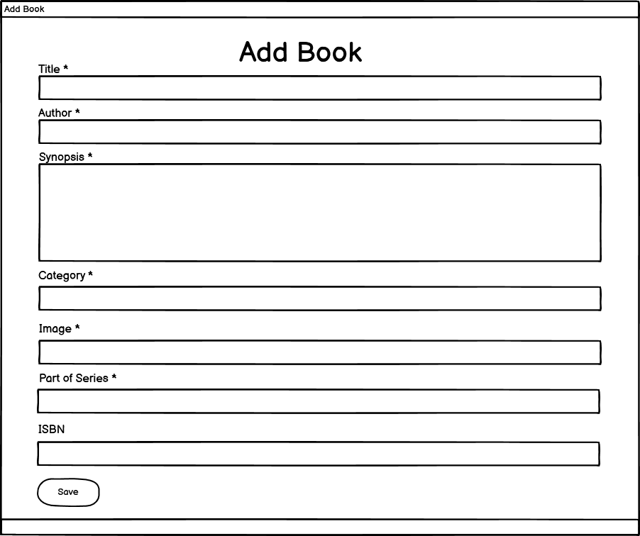

- **Member Profile**
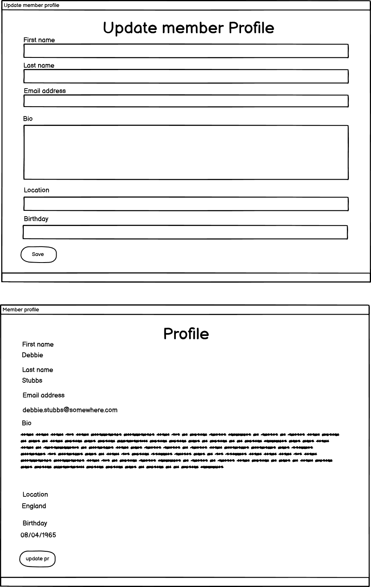

- **Pending Approval**


- **Wishlist**

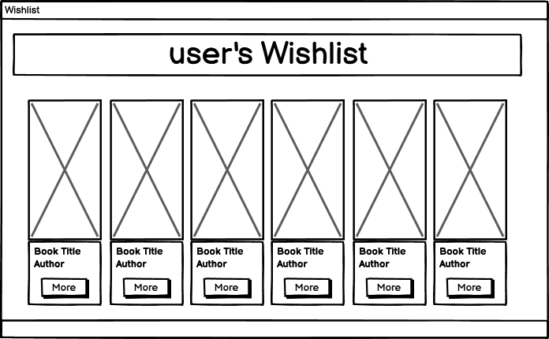

- **Django Admin**

- Django Admin panel, accessable via URL/Admin with correct ccredentials

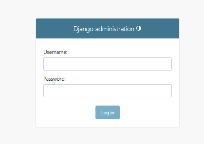
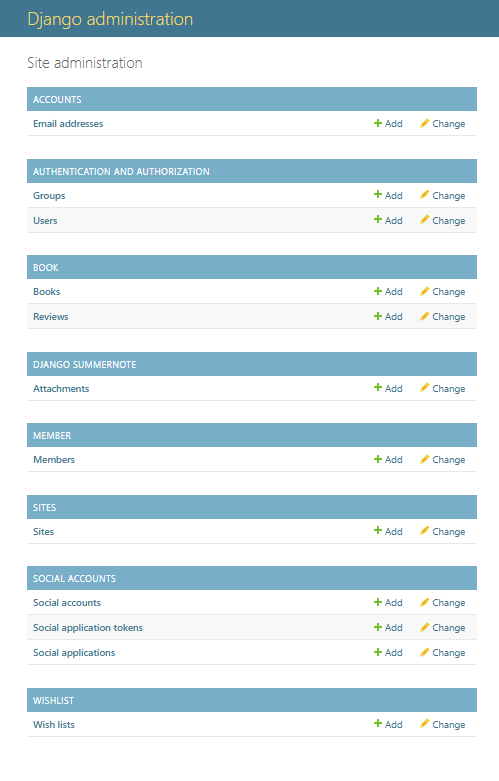


Wireframes were designed using [Balsamiq](https://balsamiq.com/), ensuring responsiveness across devices.

## Data Models

### Book Model:

- Each book in our club will have attributes such as title, author, description

### Review Model:

- The Review model will store reviews users leave for each book. It is linked both to the Book and the User models.

### WishList Model:

- The WishList Model will store information about the books that users have added to their "wishlist". It is linked both to the Book and the User models.

### User Model:

- The User model is provided by Django.

### Relationships:

#### User <-> Review:

- One-to-many relationship: One user can write multiple reviews, but each review belongs to only one user.

- Foreign Key: user_id in the Review table references the id in the User table.

#### Book <-> Review:

- One-to-many relationship: One book can have multiple reviews, but each review is linked to only one book.

- Foreign Key: book_id in the Review table references the id in the Book table.

 #### User <-> WishList:

- One-to-many relationship: One user can have many wish list entries.

- Foreign Key: user_id in the User table references the id in the WishList table.

#### Book <-> WishList:

- One-to-many relationship: Each book can appear in the "Want-to-read" list of multiple users.

- Foreign Key: book_id in the Book table references the id in the WishList table.

### Models

 **Book Model**
- title: The title of the book.
- author: The author of the book.
- synopsis: A brief summary of the book.
- slug: A URL-friendly version of the title.
- book_cover: The cover image of the book stored in Cloudinary.
- part_of_series: A boolean indicating if the book is part of a series.
- ISBN: The International Standard Book Number.
- featured: A boolean indicating if the book is featured.
- approved: A boolean indicating if the book is approved.
- uploadedby: A foreign key linking to the User who uploaded the book.
- uploadedOn: The date and time when the book was uploaded.
- category: The category of the book.

 **member Model**
- user: A one-to-one relationship with the User model.
- bio: A short biography of the member.
- location: The location of the member.
- birth_date: The birth date of the member.

 **Review Model**
- book: A foreign key linking to the Book model (many-to-one relationship). This indicates that multiple reviews can be written for a single book.
- author: A foreign key linking to the User model (many-to-one relationship). This indicates that multiple reviews can be authored by a single user.
- body: The content of the review.
- approved: A boolean indicating if the review is approved.
- created_on: The date and time when the review was created.
- rating: The rating given to the book, with a validator to ensure it's between 1 and the maximum allowed value.

 **Wishlist Model**
- user: A foreign key linking to the User model. This indicates that multiple wishlists can belong to a single user.
- book: A foreign key linking to the Book model. This indicates that multiple books can be added to a single user's wishlist.
- added_at: The date and time when the book was added to the wishlist.


### ER Diagram

The ERD for HealMate illustrates the relationships between the users, members, Books, Reviews and wishlist. This is essential to demonstrate the relationships between the different models in the PostgreSQL database.

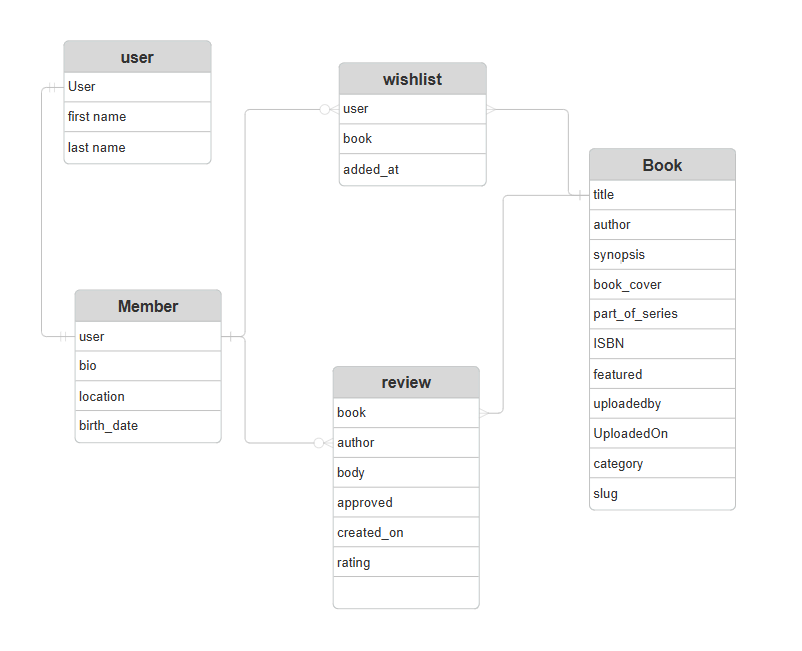

## Security

All data is securely handled with Django’s security features, including:
- CSRF protection for form submissions.
- Data encryption for sensitive information like passwords using Django's built-in authentication.
- Role-based access control to restrict sensitive data to authorized users.

## Features

### HomePage (All)


 
- Hero Section: A welcoming banner with a catchy tagline introducing the Book Nook to potential users. 

- Navigation Bar: A clean navigation bar allowing users to access the Home, and Login/Register options. Responsive design ensures usability across devices.


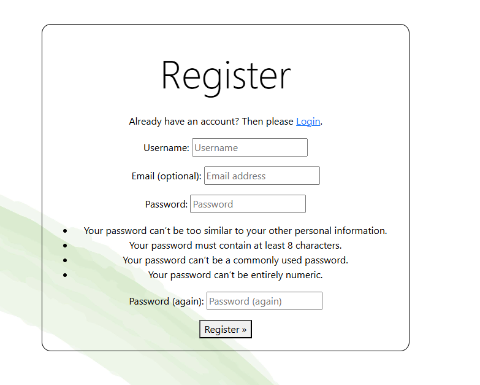

- Featured Books: A selection of popular or recently added books to engage visitors.

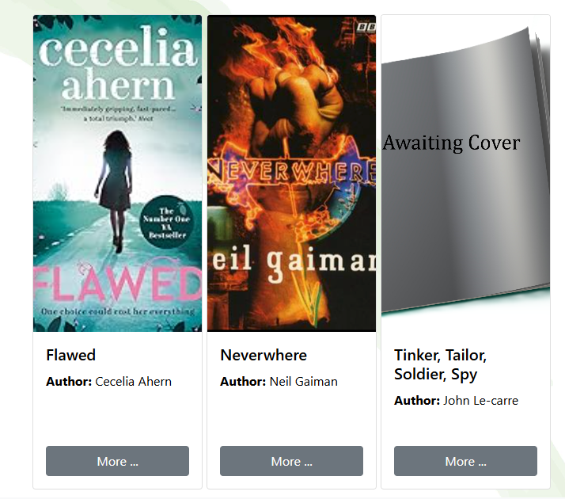

- If a user is logged in, clicking more will lead to more details of the book selected.

### Books (Loggin in User)

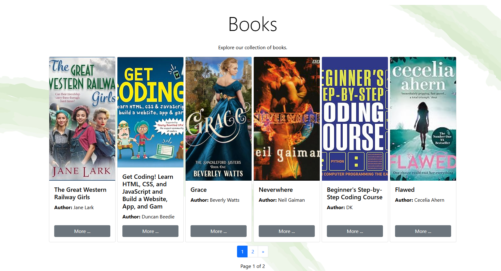

- Paginated view of books for user to select
- More button leading to more book details

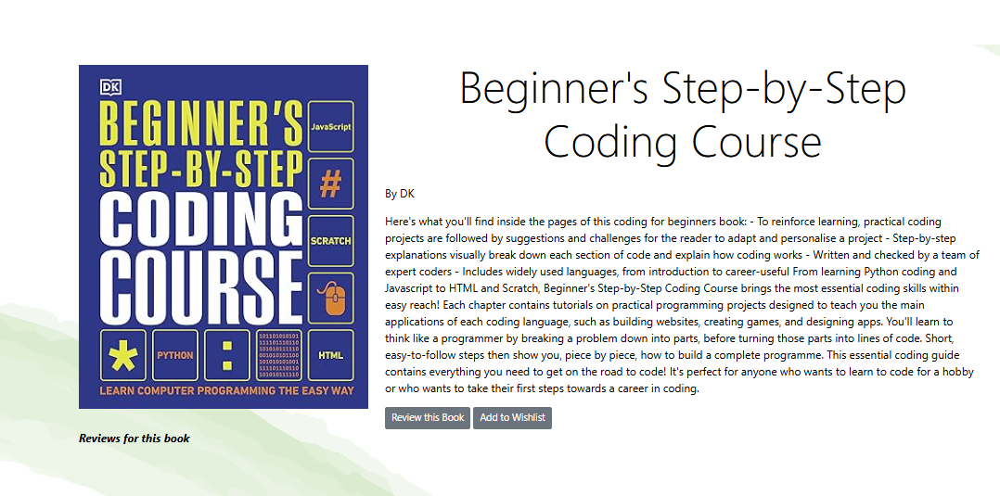

### Add Book

- Add Book Sectiion which enables members & Admin to upload Books onto the website
- Books wont show on theWebsite until approved by Admin.

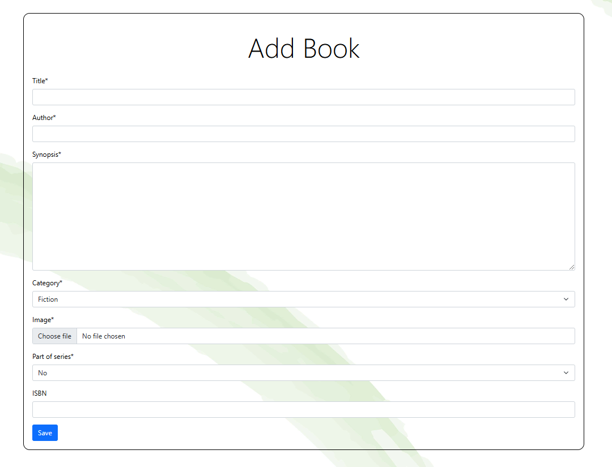

### Pending Approvals (Admin Only)

- Pending Approvals section listing all books that have been uploaded to the website for approval.
- Once approved the book will be added to the website for all to view and/or review

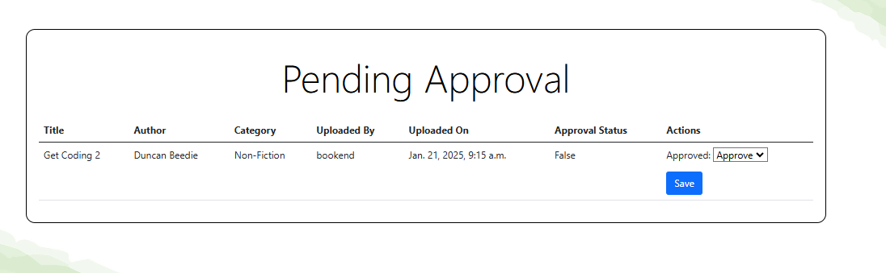

### Book List (Admin Only)

- Admin view of All Books
- Books can only be deleted by admin.  Deleting a book will also delete any associated reviews
- Unapproved Books will be highlighted in Yellow
- Rejected Books will be highlighted in Red

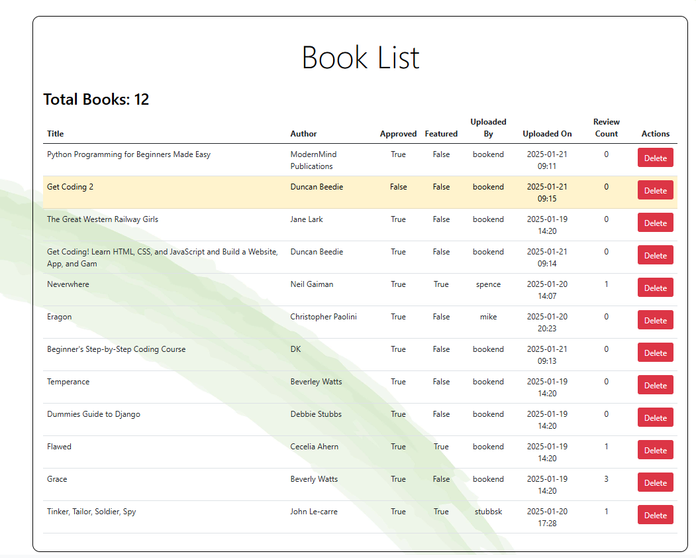

### Profile
- view of members profile, By default will be blank, but is associated with user, so all users will have a profile.
- Button to update profile

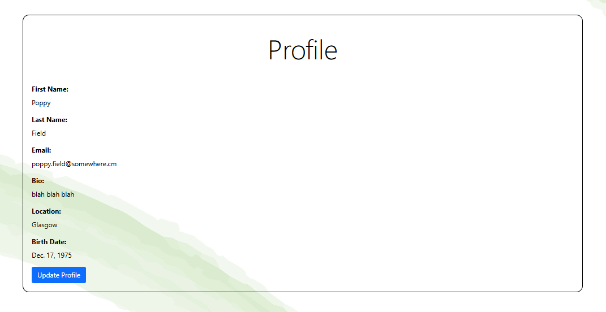
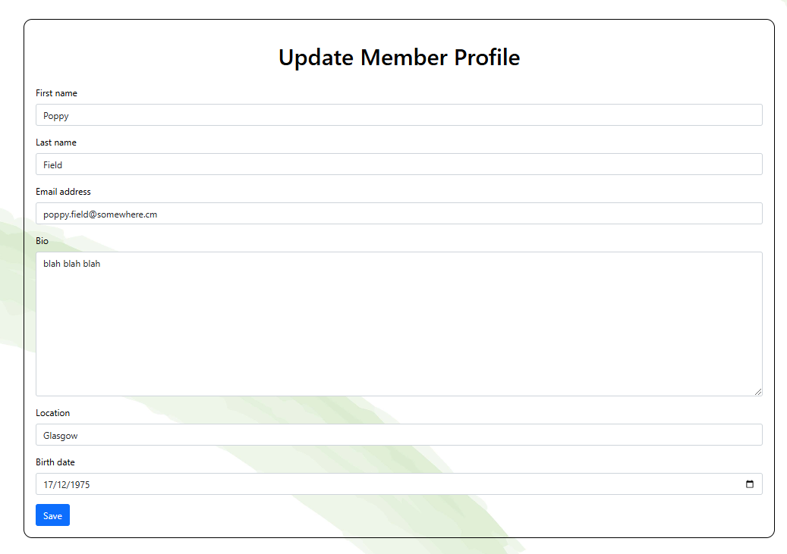


## Technologies & Languages Used

- HTML5 - Markup language for structuring the website
- CSS3 - Styling language for designing the layout and visual aesthetics
- JavaScript - For interactivity and DOM manipulation on the frontend
- Python (Django) - Backend web framework for server-side logic and management
- PostgreSQL - Database management system for storing data
- Cloudinary - Cloud-based image storage solution
- Whitenoise - For serving static files directly from Django
- SmartDraw - for ERD

## AI

Throughout this project, I have leveraged the power of artificial intelligence to enhance every aspect of development. By utilizing AI-driven suggestions, I was able to brainstorm and generate innovative ideas for key features and user stories. The AI provided invaluable assistance in formatting my code, ensuring consistency and readability across the entire project.

Furthermore, AI played a crucial role in checking my code for potential issues, debugging errors, and optimizing performance. This collaboration allowed me to maintain high code quality and adhere to best practices.

In addition to technical support, AI offered detailed explanations and step-by-step guidance on various tasks, helping me navigate complex problems and implement solutions efficiently.

Overall, the integration of AI in this project has streamlined the development process, enabling the creation of a robust and comprehensive platform that meets the needs of its users.

I didn't initially grasp the importance of URLs, but with the help of AI, I finally understood their use when it was explained in simpler terms.

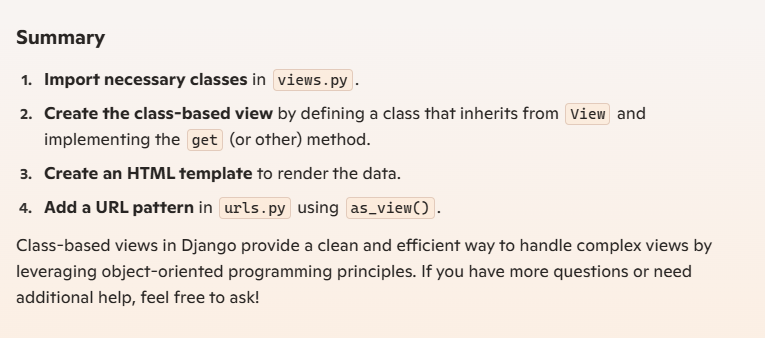
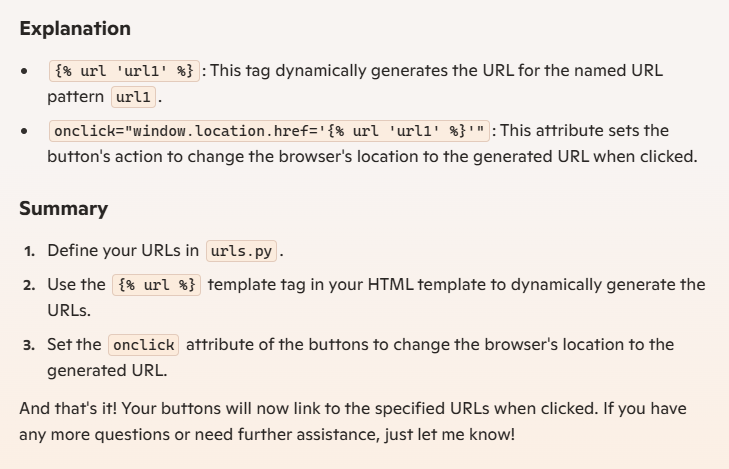
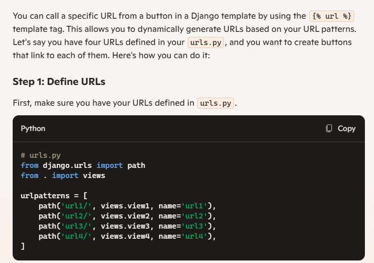

## Libraries & Frameworks
- **Django** - Backend framework
- **Django Crispy Forms** - For elegant form rendering
- **Cloudinary** - Media storage
- **Whitenoise** - For serving static files

## Tools & Programs
- **GitHub Projects** - Project management and tracking
- **Heroku** - Deployment and hosting
- **Balsamiq** - Wireframes and design prototypes

## **Testing**

### **Validation Testing**

All Pages have been run through the Wave Evaluation Tool, and have no errors  ( 2 sample pages below)

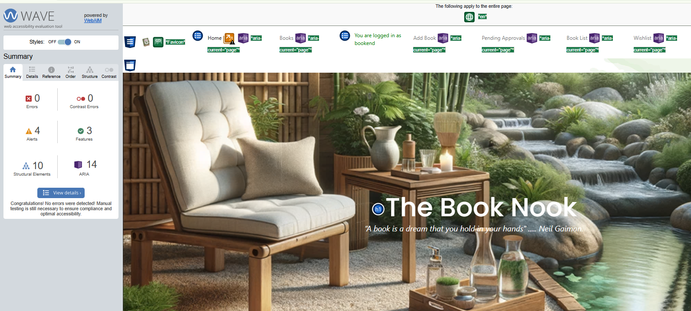
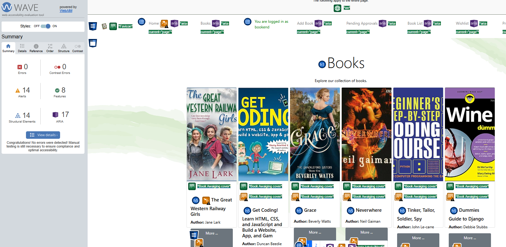

All code has been validated through:

- **HTML**: [W3C Markup Validator](https://validator.w3.org/).
- **CSS**: [W3C CSS Validator](https://jigsaw.w3.org/css-validator/).
- **Python**: PEP8 validation to ensure code quality.

<!--  -->

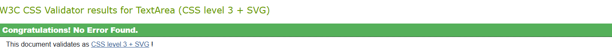


### **User Testing**

- **Browser Compatibility**: The website has been tested on Chrome Desktop, MS Edge, iphone, ipad and Android Phone
- **Responsiveness**: The platform has been tested on mobile, tablet, and desktop devices to ensure optimal performance.
- **Role-Based Dashboard Testing:** Each user type (nonuser, member, Admin) was tested to ensure they were directed to the correct dashboard after login.

## Deployment

All code for this project was written in Gitpod as the integrated development environment. GitHub was used for version control, and the application was deployed to Heroku from GitHub.

### Pre-Deployment

To ensure a successful deployment to Heroku, the following practices are to be followed (Experience from previous Django projects):

- **Requirements File:** The `requirements.txt` file must be kept up to date to ensure all imported Python modules are configured correctly for Heroku.
- **Procfile:** A `Procfile` was added to configure the application as a Gunicorn web app on Heroku.
- **Allowed Hosts:** In `settings.py`, the `ALLOWED_HOSTS` list was configured to include the Heroku app name and `localhost`. Example format:
    ```python
    ALLOWED_HOSTS = ['your-app-name.herokuapp.com', 'localhost']
    ```
- **Environment Variables:** All sensitive data such as the `DATABASE_URL`, `CLOUDINARY_URL`, and `SECRET_KEY` were added to the `.env` file, which is ignored by Git using `.gitignore`. These variables are added to Heroku manually through the Config Vars section.

### Deploying with Heroku

The steps for deploying to Heroku are as follows (Experience from previous Django projects):

1. **Create New App:** Log in to your Heroku account and click on the "Create New App" button.
2. **App Name:** Choose a unique name for your app.
3. **Select Region:** Choose the appropriate region (Europe was selected for this project).
4. **Create App:** Click the "Create App" button to proceed.
5. **Deployment Method:** In the "Deploy" tab, select GitHub as the deployment method.
6. **Connect to GitHub:** Search for the repository name and click "Connect".
7. **Manual or Automatic Deployment:** Select either manual or automatic deployment. Ensure the main branch is selected for deployment.
8. **Config Vars:** In the "Settings" tab, click "Reveal Config Vars" and input the required environment variables.
9. **Buildpack:** Select Node.js and Python as the buildpacks for your project.
10. **Deploy:** Once the configuration is complete, click the "Deploy Branch" button. After successful deployment, a "View" button will appear to take you to the live site.

The live link for this project can be found here: <a href="https://booknook2025-4c3ce9e8c031.herokuapp.com/" target="_blank">BookNook</a>

### Fork this Repository

1. Go to the GitHub repository.
2. Click the "Fork" button in the upper right-hand corner.

### Clone this Repository

1. Go to the GitHub repository.
2. Click the "Code" button at the top of the page.
3. Choose between 'HTTPS', 'SSH', or 'GitHub CLI' depending on your preference.
4. Click the copy button to copy the URL.
5. Open Git Bash.
6. Change the working directory to where you want to clone the directory.
7. Type:
    ```bash
    git clone https://github.com/DebbieCoates/BookNook2025

    ```
8. Press Enter to create the local clone.

**Note:** The difference between a clone and a fork is that with a clone, you need permission to push changes to the original repository, whereas a fork creates an entirely new project under your GitHub account.

## Credits

### Code
- **Django Documentation**: The official docs were invaluable in setting up the project structure and solving specific issues.
- **Django Crispy Forms Documentation**: Used to streamline form rendering.
- **coPilot**: For  coding ideas
- **Favicon.io**: For Favicon generation.
- **Google Fonts**: For typography.
- **Bootstrap 5**: for layout.

### Media

- Icons and images sourced from **Creative Fabrica** and **favicon**.

### Additional tutorials/books/blogs

- Django 5 By Example, by Antonieo mele
- Codemy.com

## Acknowledgements

I would like to extend my heartfelt gratitude to the following individuals and organizations whose support, guidance, and inspiration have been invaluable in the development of this project.

### Mentors and Advisors

- **To all my amazing classmates**

I want to extend a heartfelt thank you to each and every one of you. We've had an environment where laughter, encouragement, and support have flourished. The camaraderie we've built has made this journey not only educational but genuinely enjoyable. The ability to have a laugh and joke has lightened the workload. When challenges arose, helping and encouraging each other made all the difference.

I'm grateful to be part of such an incredible group. Thank you for being such fantastic classmates!

- **Amy Richardson** 

I extend my deepest gratitude to Amy Richardson, my tutor and facilitator, for her unwavering support and expert guidance throughout this journey. Her mentorship provided the clarity and confidence I needed to overcome challenges, which significantly enhanced the quality of this project. Amy's dedication and encouragement have left a lasting impact on my progress and learning. Her departure is a great loss to both our class and the Code Institute, as her influence and expertise truly made a difference. Moreover, her positive attitude and steadfast support always uplifted the group – she was genuinely a ray of sunshine, always cheerful and encouraging, regardless of the circumstances. I am incredibly thankful for your commitment and for taking on the challenge of leading us with such dedication. Thank you for everything!

- **Vasilica Pavaloi**

A big thank you to Vasilica Pavaloi for stepping in when Amy left and guiding us through the final weeks of our project. You helped us stay focused and motivated, and got us to the finish line. Thank you for everything

- **Spencer Barriball, Roo MacArthur & John Reardon** 

A big thank you to Spencer, John, and Roo for all their support, helpful feedback, and constructive criticism throughout this project. Their knowledge and encouragement really pushed me to improve and kept me on track. The Coding Coach channel was an absolute lifeline. This project wouldn’t have been the same without their guidance.

### Supportive Friends and Family
- My friends and family, especially, for their encouragement and patience during this project. Your belief in me kept me motivated and focused.

### Academic Institutions
- **Code Institute** – Thank you for providing the learning environment and resources that made this project possible. I am especially grateful to the professors and staff at Code Institute for their valuable insights.

### Final Note
This project would not have been possible without the support, advice, and inspiration of each individual and organization mentioned. Thank you for being a part of this journey.

